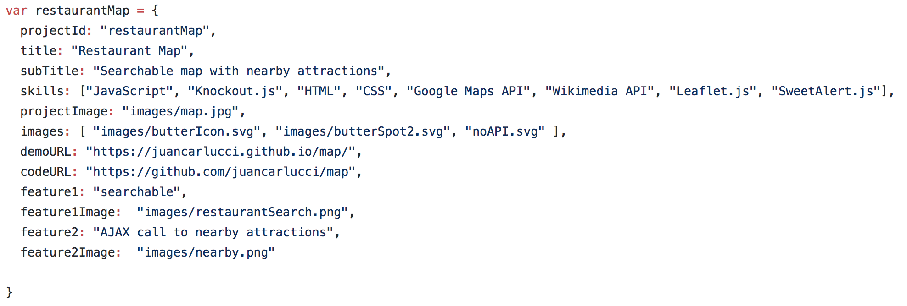
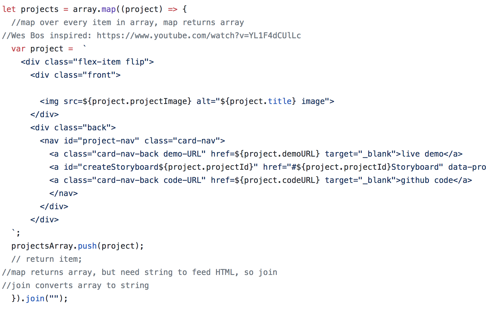
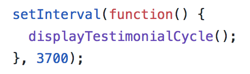

# about
Portfolio and resume site for Juan Carlos Collins

## Technologies used:

JavaScript, HTML5, CSS3, jQuery, Sass, Git, Github, Koala

## Process/approach:

Build website with two types of users in mind: recruiters and project managers.

Whiteboard basic concept

Create wireframe using Figma

Create Client side including Portfolio, About, and Contact sections

Optimize images and files (compression, minification, etc.)

## Unsolved problems:

## Biggest wins and challenges:

Biggest win:  Mapping over array of objects to extract information and add elements to the DOM

Biggest challenge: 

Difficult time integrating change of class on scroll.

## Code Snippets

Object Literals

Map over array of objects to create DOM 

Its all about timing

